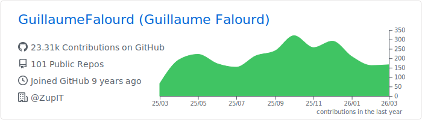

<h1> Hello World ! </h1>

### I'm a 🇫🇷 Software Developer living in 🇧🇷 and working at [Zup Innovation](https://www.zup.com.br/).

### Languages & Tools 🛠

     &nbsp;

    &nbsp;

     &nbsp;

    &nbsp;

  

 

### Analytics ⚙️

  

  
<!--    -->

  

### Let's connect ? 🤝

### Customize your README profile 🧑‍💻⭐

#### 👉   _[Statistics](https://github.com/anuraghazra/github-readme-stats) ➕  [Summary Cards](https://github.com/vn7n24fzkq/github-profile-summary-cards) ➕  [Snake animation](https://github.com/Platane/snk) ➕  [Metrics](https://github.com/marketplace/actions/metrics-embed)_

#### 👉   _[STEP by STEP to create a similar README profile](https://bit.ly/devtoritgithubcreateprofile)_

#### ... or fork this repository! 😁
