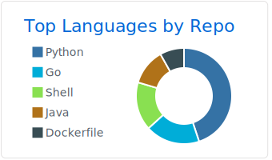
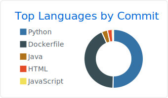
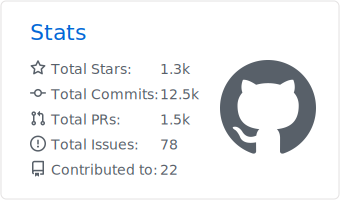

 

<h1> Hello World ! </h1>

### I'm a 🇫🇷  Software Developer living in 🇧🇷 and working at [Zup Innovation](www.zup.com.br).

### Languages & Tools 🛠

&nbsp;
&nbsp;
&nbsp;
&nbsp;
&nbsp;
&nbsp;

&nbsp;
&nbsp;
&nbsp;
&nbsp;
&nbsp;

&nbsp;
&nbsp;
&nbsp;
&nbsp;
&nbsp;
&nbsp;

&nbsp;
&nbsp;
&nbsp;
&nbsp;
&nbsp;

### Analytics ⚙️

<!-- 

  
  
  

 -->

### Let's connect ? 🤝

#### _References: [Snake animation](https://github.com/Platane/snk) ➕ [Statistics](https://github.com/anuraghazra/github-readme-stats) ➕ [Summary Cards](https://github.com/vn7n24fzkq/github-profile-summary-cards)_
