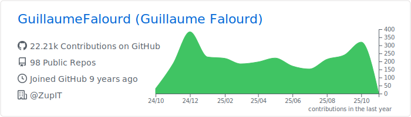
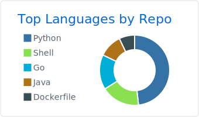
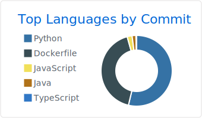

 

<h1> Hello World ! </h1>

I'm a Software Developer and Community Manager at [Zup Innovation](https://zup.com.br).

Feel free to ask me anything about ZupIT open source products: [CharlesCD](https://github.com/ZupIT/charlescd) | [Ritchie CLI](https://github.com/ZupIT/ritchie-cli) | [Beagle](https://github.com/ZupIT/beagle) | [Horusec](https://github.com/ZupIT/horusec)

### Languages and Tools 🛠

&nbsp;
&nbsp;
&nbsp;
&nbsp;
&nbsp;
&nbsp;
&nbsp;

&nbsp;
&nbsp;
&nbsp;
&nbsp;
&nbsp;
&nbsp;

&nbsp;
&nbsp;
&nbsp;
&nbsp;
&nbsp;

### Let's connect 🤝🏻

    

### Analytics ⚙️

<!-- 

  
  
  

 -->
